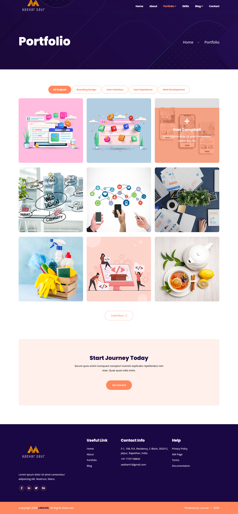
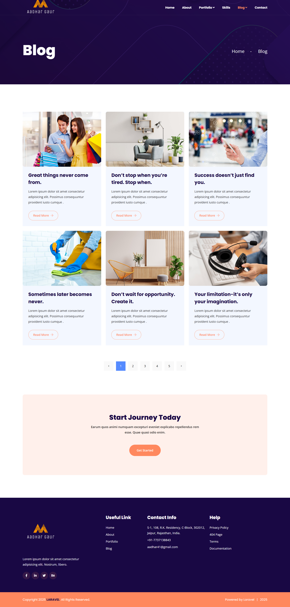
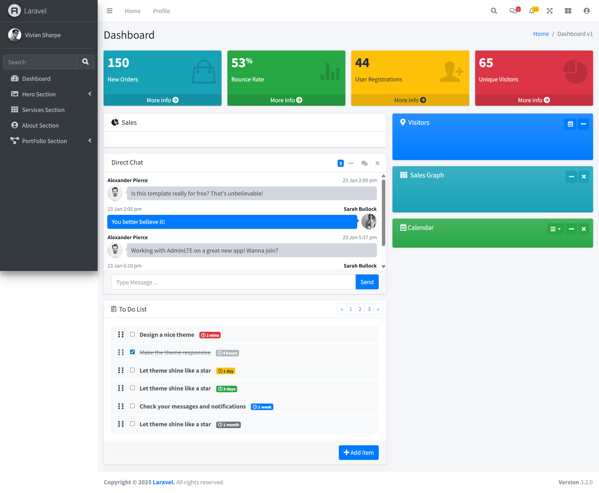
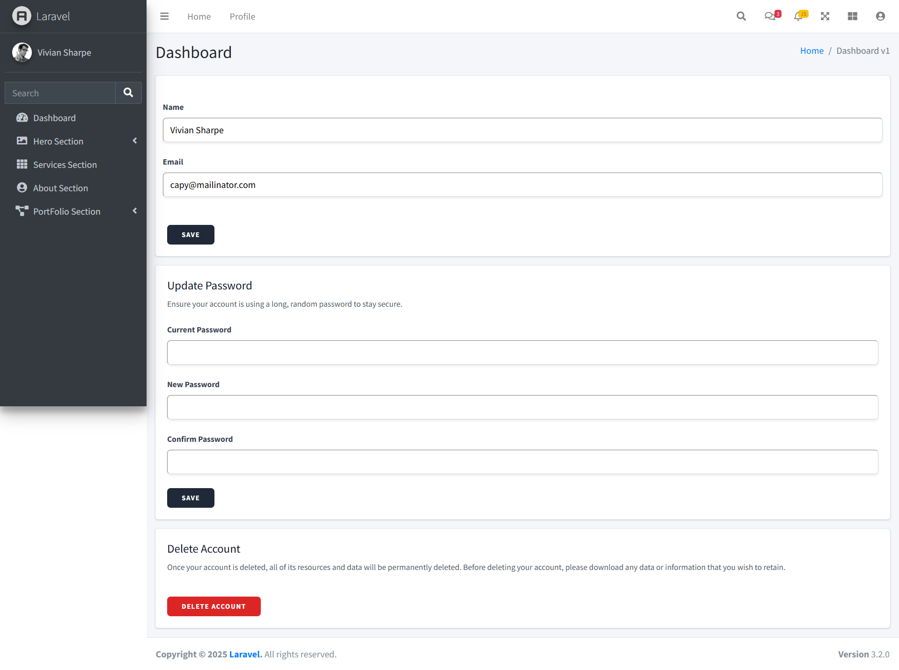
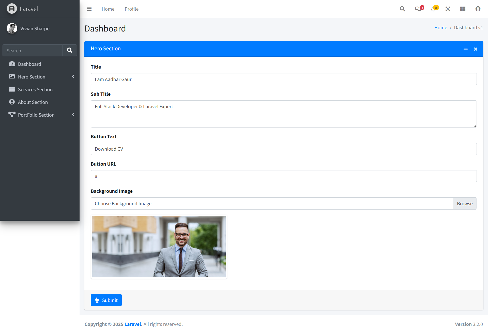
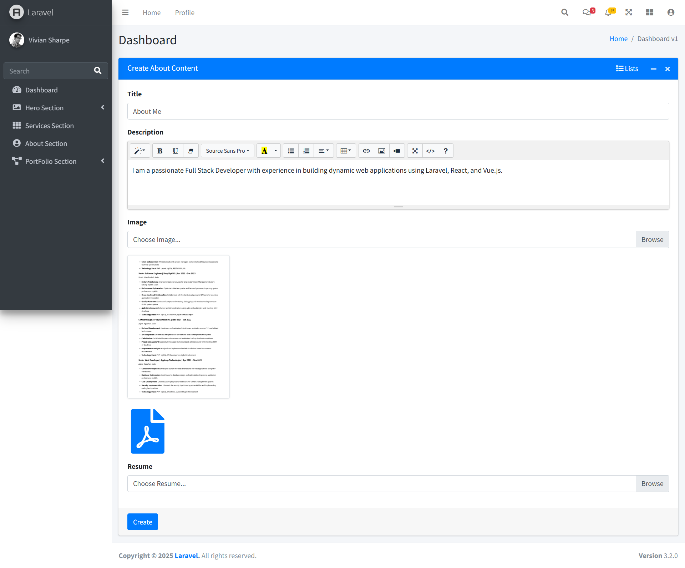
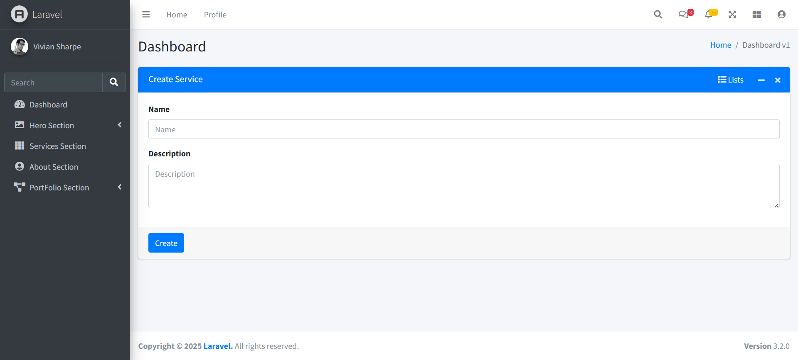
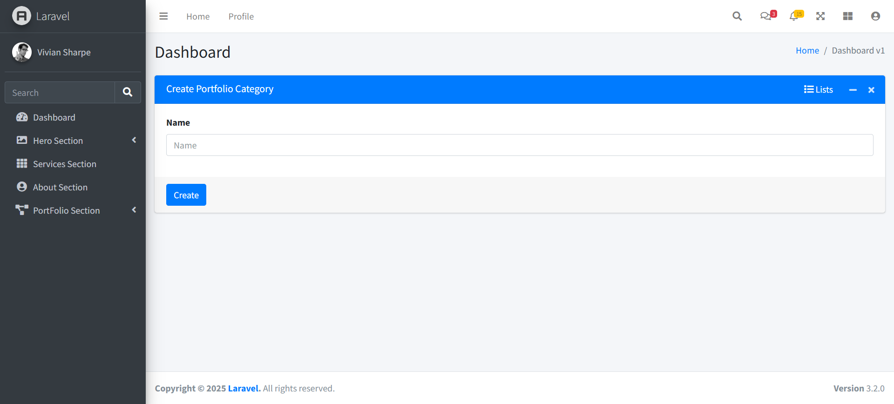
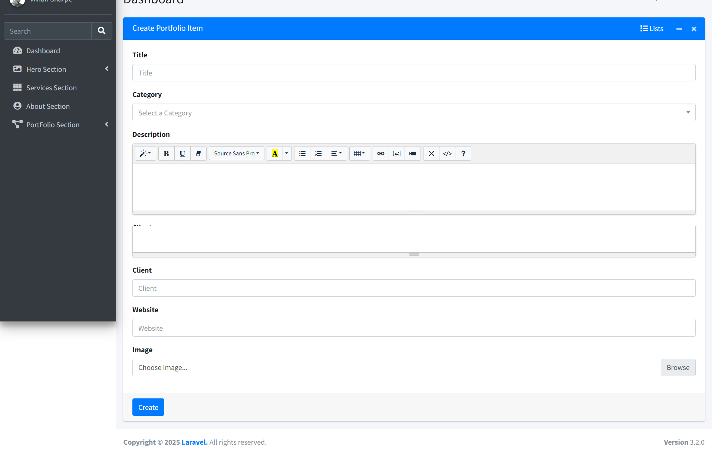
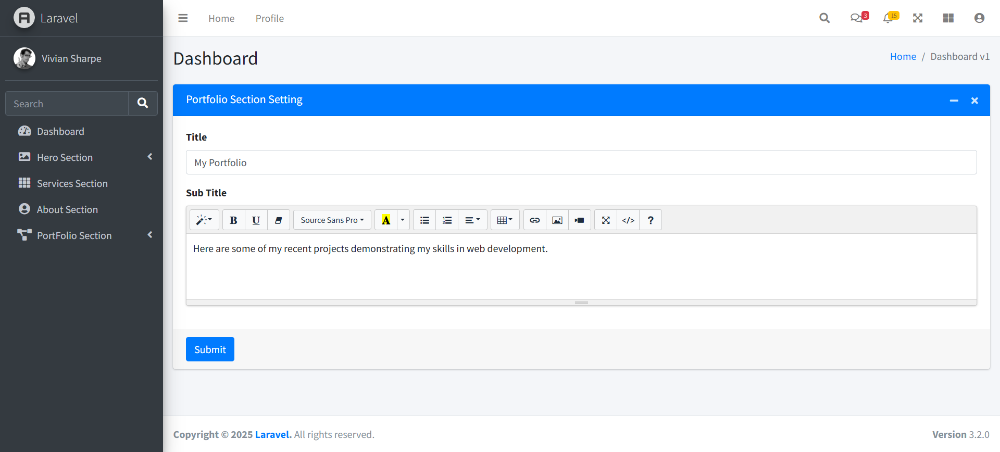

# Dynamic Portfolio Website

A comprehensive Content Management System (CMS) based Portfolio Builder built with Laravel. This application allows users to dynamically manage their portfolio website content, including Hero sections, About details, Services, Skills, Portfolio items, and more, all through a secure Admin Dashboard.

## Features

- **Dynamic Content Management**: Fully manageable Hero, About, Services, and Category sections.
- **Portfolio Management**: detailed portfolio item management with category association.
- **Admin Dashboard**: Secure and responsive admin panel powered by Laravel Breeze and Tailwind CSS.
- **Data Tables**: Advanced data sorting, searching, and pagination using Yajra Datatables.
- **Export Functionality**: Export data lists to Excel for offline analysis.
- **Toast Notifications**: Real-time feedback for user actions.

## Tech Stack

- **Framework**: [Laravel 10.x](https://laravel.com/)
- **Language**: PHP 8.1+
- **Database**: MySQL
- **Styling**: [Tailwind CSS](https://tailwindcss.com/)
- **Authentication**: Laravel Breeze
- **Frontend Tooling**: Vite
- **Libraries**:
  - `yajra/laravel-datatables`: For advanced table interactions.
  - `maatwebsite/excel`: For data export.
  - `yoeunes/toastr`: For notifications.

## Installation and Setup

Follow these steps to set up the project locally:

1. **Clone the Repository**

    ```bash
    git clone https://github.com/aadhar41/portfolio-website.git
    cd portfolio-website
    ```

2. **Install PHP Dependencies**

    ```bash
    composer install
    ```

3. **Install Node Dependencies**

    ```bash
    npm install && npm run dev
    ```

4. **Environment Configuration**
    Copy the example environment file and generate the application key:

    ```bash
    cp .env.example .env
    php artisan key:generate
    ```

5. **Database Configuration**
    - Create a database (e.g., `portfolio_db`) in your MySQL server.
    - Update the `.env` file with your database credentials:

        ```env
        DB_CONNECTION=mysql
        DB_HOST=127.0.0.1
        DB_PORT=3306
        DB_DATABASE=portfolio_db
        DB_USERNAME=root
        DB_PASSWORD=
        ```

6. **Run Migrations**
    Run the migrations to create the necessary tables for the CMS (users, heroes, services, portfolios, etc.):

    ```bash
    php artisan migrate
    ```

7. **Link Storage**
    Create the symbolic link to access uploaded files from the public directory:

    ```bash
    php artisan storage:link
    ```

8. **Start the Server**

    ```bash
    php artisan serve
    ```

    Access the application at `http://localhost:8000`.

## Application Screenshots

### Frontend

| Home Page | Portfolio Page | Blog Page |
| --- | --- | --- |
|  |  |  |

### Admin Dashboard

| Dashboard | Profile |
| --- | --- |
|  |  |

### Admin Management

| Hero Section | About Section | Services |
| --- | --- | --- |
|  |  |  |

| Category | Portfolio Item | Portfolio Settings |
| --- | --- | --- |
|  |  |  |

## License

Distributed under the MIT License. See `LICENSE` for more information.

---

## Author

**Aadhar Gaur**

- **GitHub**: [@aadhar41](https://github.com/aadhar41)
- **LinkedIn**: [aadhar-gaur-php](https://linkedin.com/in/aadhar-gaur-php)

---

## Acknowledgments

- Built with ❤️ using [Laravel 10](https://laravel.com/) & [Tailwind CSS](https://tailwindcss.com/)
- Secure authentication via [Laravel Breeze](https://laravel.com/docs/10.x/starter-kits#laravel-breeze)
- Data export powered by [Laravel Excel](https://docs.laravel-excel.com/)
